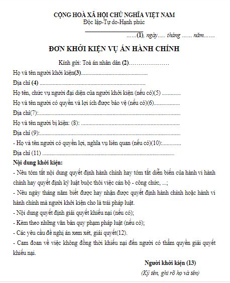
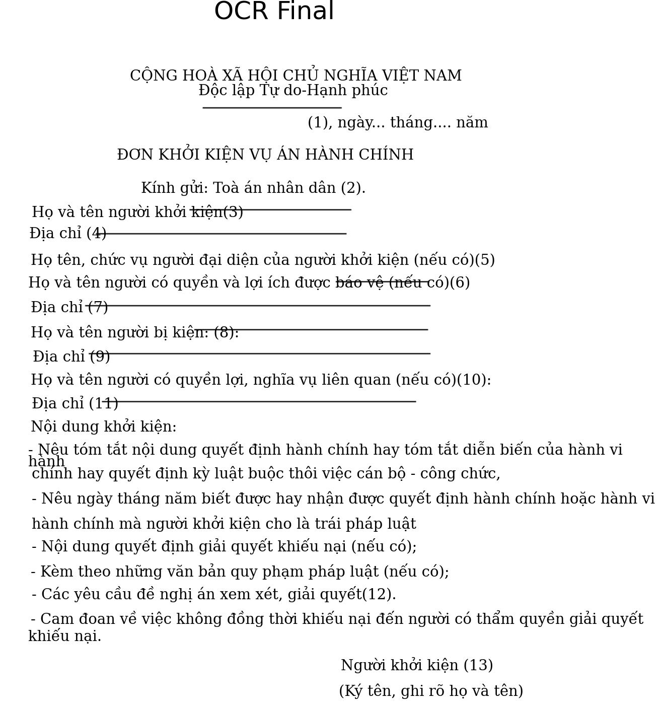

English | [Vietnamese](README_vn.md)

## Setup

- Clone  this project:

```[bash]
git clone https://github.com/KaiKenju/Vietnamese_OCR_documents
```

- Initial enviromment with Miniconda:

```[bash]
conda create -n <env_name> python=3.8
```
- Activate conda
```[bash]
conda activate <env_name> 
cd Vietnamese_OCR_documents
```
Run the commands:
```[bash]
pip install -r requirements.txt
pip install reportlab
<!-- cd PaddleOCR
pip install -e . -->
```

## Run
* if you want to understand how the system works, please run:
```[bash]
python main.py
```
* else, best performance:
```[bash]
python performance_thread.py
```
## Result
<table>
  <tr>
    <td></td>
    <td></td>
  </tr>
</table>

## Structure Project
```[bash]
Vietnamese_OCR_Documents/
          ├── assets/              # contains image to OCR
          ├── config/              #  configuration files and options for OCR system
          ├── cropped_images/      # Images are cropped for recognition purposes
          ├── folder_file_api/     # file pdf,word after OCR for web-app using Fast-api
          ├── weight/              # The weight  of system
          ├── PaddleOCR/           # Paddle repositories
          ├── static/              # front-end 
          ├── app.py/              # demo web(local-host) using FastAPI 
          ├── Core_OCR.ipynb/      # notebook paddleOCR + vietOCR
          ├── image_processing.py/ # image processing
          ├── main.py 
          ├── performance_thread/  # performance optimization (faster main.py using thread)
          ├── Pretrained_vietOCR/  # training VietOCR
          ├── requirements.txt     
          ├── README.md            # english version
          ├── README_vn.md         # vietnamese version
          ```
