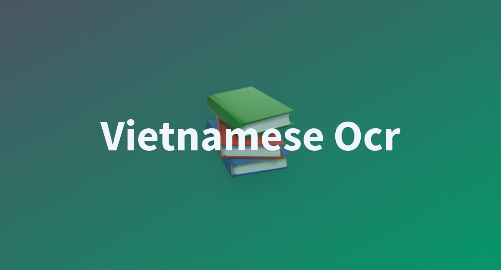

<div align="center">


<h1>OCR Vietnamese</h1>

 🌎 [English](README.md) / Vietnamese 



</div>

<br>

> **Related Projects**：
>
> - [Recognition-table-with-table-transformer](https://github.com/KaiKenju/Recognition-Table-with-Table_Transformer-and-vietOCR): Sự kết hợp giữa Table Transformer và vietOCR tạo ra một hệ thống nhận dạng bảng mạnh mẽ, trích xuất cấu trúc bảng từ hình ảnh và đồng thời nhận dạng các ký tự tiếng Việt. Table Transformer xử lý bố cục và cấu trúc bảng, trong khi vietOCR tập trung vào nhận dạng ký tự chính xác, cung cấp độ chính xác cao trong việc trích xuất dữ liệu bảng từ các tài liệu tiếng Việt.

<br>

<br>

# Table of Contents
- [Table of Contents](#table-of-contents)
  - [🛠️ Cài Đặt](#️-cài-đặt)
  - [▶️ Khởi chạy](#️-khởi-chạy)
  - [📝 Kết quả](#-kết-quả)
  - [Video Demo](#video-demo)
  - [🚀 Cấu trúc của project](#-cấu-trúc-của-project)
  - [🚀 Detection: PaddleOCR](#-detection-paddleocr)
  - [⚡ Recognition: VietOCR](#-recognition-vietocr)
- [📧 Contact Us](#-contact-us)
- [Contributors](#contributors)

<br>


## 🛠️ Cài Đặt

- Clone project:

```[bash]
git clone https://github.com/KaiKenju/Vietnamese_OCR_documents
```

- Khởi tạo môi trường với Miniconda:

```[bash]
conda create -n <env_name> python=3.8
```
- Kích hoạt conda
```[bash]
conda activate <env_name> 
cd Vietnamese_OCR_documents
```

- Chạy lần lượt các lệnh:

```[bash]
pip install -r requirements.txt
pip install reportlab
```

## ▶️ Khởi chạy
* 🔥 Chạy file main nếu muốn hiểu cách nó hoạt động 
```[bash]
python main.py
```
* ✅ Còn ko thì chỉ quan tâm OCR(dùng thread) cuối cùng thì chạy:
```[bash]
python performance_thread.py
```
## 📝 Kết quả
<table>
  <tr>
    <td></td>
    <td></td>
  </tr>
</table>

## Video Demo
https://github.com/m1guelpf/readme-with-video/assets/94727276/2d434abb-7b71-4bca-9e0f-a3baad53a02c

## 🚀 Cấu trúc của project
```[bash]
Vietnamese_OCR_Documents/
        ├── Multi_page/               # folder chứa PDF và Word sau khi thực hiện OCR nhiều trang PDF
        ├── PaddleOCR/                # Paddle repositories
        ├── assets/                   # chứa ảnh để OCR
        ├── config/                   # lựa chọn config cho hệ thống OCR 
        ├── cropped_images/           # ảnh được cắt để nhận dạng tiếng việt
        ├── folder_file_api/          # file pdf ,word sinh ra từ OCR
        ├── weight/                   # trọng số 
        ├── static/                   # front-end 
        ├── app.py                    # demo web(local-host) using FastAPI 
        ├── Core_OCR.ipynb            # notebook paddleOCR + vietOCR
        ├── image_processing.py       # tiền xử lý ảnh 
        ├── main.py 
        ├── performance_thread/       # xử lý OCR nhanh hơn (dùng thread) main.py 
        ├── Pretrained_vietOCR.ipynb  # đào tạo bộ dữ liệu VietOCR
        ├── requirements.txt          # lib,..
        ├── README.md                 # phiên bản tiếng anh
        ├── README_vn.md              # phiên bản tiếng việt
```

## 🚀 Detection: PaddleOCR
[PaddleOCR](https://github.com/PaddlePaddle/PaddleOCR/tree/main) là một  mã nguồn mở được phát triển bởi Baidu PaddlePaddle để hỗ trợ nhận dạng và trích xuất thông tin từ hình ảnh. Ban đầu, PaddleOCR hỗ trợ nhận dạng tiếng Anh, tiếng Trung, số và xử lý văn bản dài. Hiện tại nó đã mở rộng hỗ trợ sang nhiều ngôn ngữ hơn như tiếng Nhật, tiếng Hàn, tiếng Đức,… Tuy nhiên, PaddleOCR hiện chưa hỗ trợ tiếng Việt.

🌟 Features:

[PaddleOCR](https://github.com/PaddlePaddle/PaddleOCR/blob/main/README_en.md) hỗ trợ nhiều thuật toán tiên tiến liên quan đến OCR và phát triển các mô hình/giải pháp đặc trưng công nghiệp PP-OCR, PP-Structure và PP-ChatOCR trên cơ sở này, đồng thời thực hiện toàn bộ quá trình sản xuất dữ liệu, đào tạo mô hình, nén, suy luận và triển khai.


Trong cấu hình paddle file , [DB](https://arxiv.org/pdf/1911.08947) (Differentiable Binarization) thường được sử dụng để phát hiện văn bản một cách chính xác, nhanh chóng với mọi hình dạng


## ⚡ Recognition: VietOCR

[VietOCR](https://github.com/pbcquoc/vietocr) là sự kết hợp giữa CNN và  Languages Model : AttentionOCR và TransformerOCR

Tuy nhiên, mô hình này chỉ hoạt động trên hình ảnh một dòng văn bản có chữ viết tay và chữ in

[AttentionOCR](https://arxiv.org/pdf/1706.03762)


[TransformerOCR](https://pbcquoc.github.io/transformer/)


Thư viện [VietOCR](https://pbcquoc.github.io/vietocr/) được xây dựng với mục đích hỗ trợ các bạn sử dụng nó để giải quyết các vấn đề liên quan đến OCR trong công nghiệp. Thư viện cung cấp cả kiến ​​trúc AtentionOCR và TransformerOCR. Mặc dù kiến ​​trúc TransformerOCR hoạt động khá tốt trong NLP nhưng theo tôi độ chính xác không có sự cải thiện đáng kể so với Chú ýOCR và thời gian dự đoán chậm hơn nhiều.

<br>

# 📧 Contact Us

Nếu bạn có câu hỏi nào, hãy liên hệ email hiepdv.tb288@gmail.com

<br>

# Contributors

<a href="https://github.com/KaiKenju/Vietnamese_OCR_documents/graphs/contributors">
 
</a>

[Kai-Kenju](https://github.com/KaiKenju)