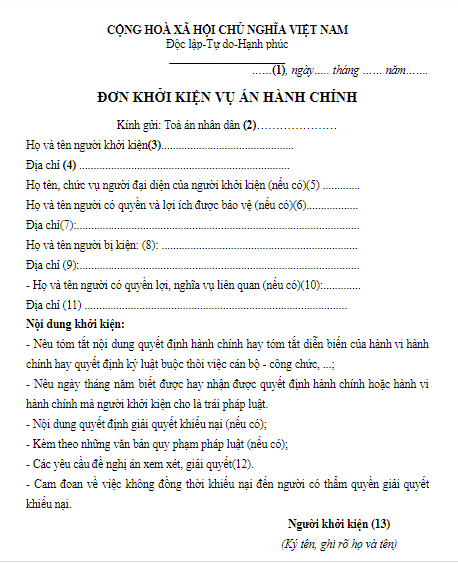

[English](README.md) | Vietnamese

## Cài Đặt

- Clone  this project:

```[bash]
git clone https://github.com/KaiKenju/Vietnamese_OCR_documents
```

- Initial enviromment with Miniconda:

```[bash]
conda create -n <env_name> python=3.8
```
- Activate conda
```[bash]
conda activate <env_name> 
cd Vietnamese_OCR_documents
```

Chạy lần lượt các lệnh:

```[bash]
pip install -r requirements.txt
pip install reportlab
<!-- cd PaddleOCR
pip install -e . -->
```

## Khởi chạy
* if you want to understand how the system works, please run:
```[bash]
python main.py
```
* else, best performance:
```[bash]
python performance_thread.py
```
## Kết quả
<table>
  <tr>
    <td></td>
    <td></td>
  </tr>
</table>

## Cấu trúc của project
Vietnamese_OCR_Documents/
├── assets/  # 	chứa ảnh để OCR
├── config/  #  lựa chọn config cho hệ thống OCR 
├── cropped_images/  # ảnh được cắt để nhận dạng tiếng việt
├── folder_file_api/  # file pdf ,word sinh ra từ OCR
├── weight/  # trọng số 
├── PaddleOCR/  # Paddle repositories
├── static/  # front-end 
├── app.py/  demo web(local-host) using FastAPI 
├── Core_OCR.ipynb/  # notebook paddleOCR + vietOCR
├── image_processing.py/  # tiền xử lý ảnh 
├── main.py 
├── performance_thread/  # xử lý OCR nhanh hơn (dùng thread) main.py 
├── Pretrained_vietOCR/  # đào tạo bộ dữ liệu VietOCR
├── requirements.txt  # lib,..
├── README.md  #  phiên bản tiếng anh
├── README_vn.md  #  phiên bản tiếng việt
